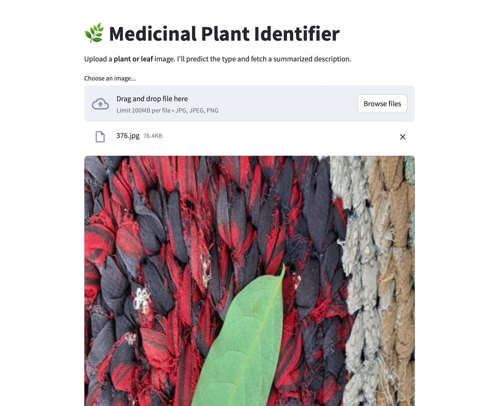
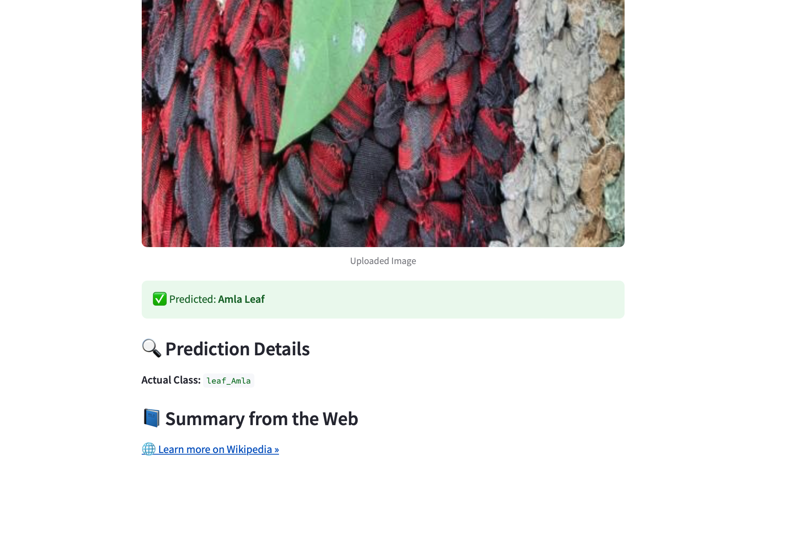

# 🧠 Identification and Classification of Medicinal Plant 

This project uses a **VGG16-based Convolutional Neural Network (CNN)** to classify medicinal plants from images of either **leaves** or **entire plants**. It features a **Streamlit-powered web app** that predicts the plant type and dynamically fetches a summary from **Wikipedia** or **Healthline**.

---

## 🌿 Motivation

Medicinal plants are vital in herbal medicine, agriculture, and biodiversity. However, accurate identification from images is often difficult due to variations in shape, lighting, and perspective. This project aims to solve that problem using deep learning.

---

## 🧠 Model Architecture

- **Base Model**: Pre-trained `VGG16` (from Keras, trained on ImageNet)
- **Modifications**:
  - Removed top classification layers
  - Added `Flatten`, `Dense`, `Dropout`, and final `Softmax` layers
- **Image Input Size**: 224 × 224 × 3
- **Final Layer**: Number of output classes = Number of unique folders in dataset (leaf & plant variants)

---

## 🗂️ Dataset Structure

The dataset is custom-organized under `combined_dataset/` into three subsets: `train/`, `test/`, and `valid/`, each having subfolders for every class.

```
combined_dataset/
├── train/
│   ├── tulsi_leaf/
│   ├── tulsi_plant/
│   ├── neem_leaf/
│   ├── neem_plant/
│   └── ... more classes
├── test/
│   └── same structure as train/
├── valid/
│   └── same structure as train/

```

- Each subfolder contains images of a specific class (either leaf or plant).
- Folders are named like `plantname_leaf` and `plantname_plant` to differentiate.
- Helps the model generalize better by learning from both parts of the plant.

---

## 🚀 Features

- 📤 Upload an image of a **leaf** or **whole plant**
- 🔍 Real-time prediction using a fine-tuned VGG16 model
- 📑 Automatically fetch plant description from:
  - Wikipedia (preferred)
  - Healthline (fallback if Wikipedia fails)
- 🧾 Displays:
  - Predicted class (e.g., "Neem Plant")
  - Actual internal class label
  - Dynamic summary
  - External knowledge links

---

## 🖼️ Web App (`app.py`)

### 🔧 Core Functionality:
- Loads your `medicinal_model.keras` model
- Preprocesses and predicts image class using TensorFlow
- Uses `requests` and `BeautifulSoup` to fetch description from Wikipedia
- Provides fallback search using Healthline

### 📋 Example Output:
✅ Predicted: Tulsi Leaf
🔍 Actual Class: tulsi_leaf

🌐 Learn more on Wikipedia »

1. User is asked to upload an image
2. A new test image is used for prediction
   


4. Image is classified into its appropriate classes
5. Prints the actual class
6. Prints the predicted class
7. Gives a link for the direct access to the wikipedia of the plant that has been identified
   


---

## 🔧 Installation & Running Locally

### 1. Clone the Repo

```bash
git clone https://github.com/sureshkumar2704/Medicinal-Plant-Classification.git
cd Medicinal-Plant-Classification
```
### 2. Install Dependencies
```
pip install -r requirements.txt
```
### 3. Launch the App
``` streamlit run app.py
```
---
## 🛠️ Built With

TensorFlow <br>
VGG16 <br> 
Streamlit <br>
BeautifulSoup4 <br>

---

## 🌟 Advantages of VGG16

### 1. Pretrained on a Large Dataset (ImageNet)
VGG16 is trained on ImageNet, which contains over 14 million images across 1000 classes.
This means VGG16 has already learned rich, general-purpose image features (edges, textures, shapes, etc.). 
<br> ✅ How it helps you: You can leverage these learned features through transfer learning, even with a relatively smaller medicinal plant dataset.

### 2. Simple and Consistent Architecture
VGG16 uses only 3x3 convolution filters and 2x2 max pooling, stacked in a very uniform and repeatable way.
<br> This makes it:
- Easy to understand and modify
- Reliable for image classification tasks
<br>
✅ How it helps you: You can easily remove the top layers and add your custom classification head for leaf and plant categories.

### 3. Deep Enough to Learn Complex Patterns
With 16 weight layers, VGG16 is deep enough to learn fine-grained visual distinctions (like differences between a tulsi leaf and a neem leaf).
<br> ✅ How it helps you: It can capture the subtle differences in texture, vein pattern, and structure between different species.

### 4. Strong Performance in Transfer Learning
VGG16 is known to perform well in many fine-tuning applications, especially in medical and agricultural image analysis.
<br> ✅ How it helps you: You don’t need to train a deep model from scratch. Instead, you retrain only the last few layers, which:
- Saves time
- Requires less data
- Avoids overfitting
  
### 5. Community Support and Compatibility
VGG16 is one of the most popular CNN architectures with extensive support in:
- Keras, TensorFlow
- Pretrained weights available instantly
- Easy to deploy in apps (like yours with Streamlit)
<br>✅ How it helps you: You can integrate it smoothly in your Streamlit app without writing low-level code.

The architecture diagram for VGG-16 is shown below: 


## 🚧 Future Work

Enhance model with more diverse plant images
Add multilingual description generation
Enable offline summary caching
Add image enhancement and correction features

---

## 🍂 Dataset

I have used the dataset from [Kaggle](https://www.kaggle.com/datasets/aryashah2k/indian-medicinal-leaves-dataset)

---
